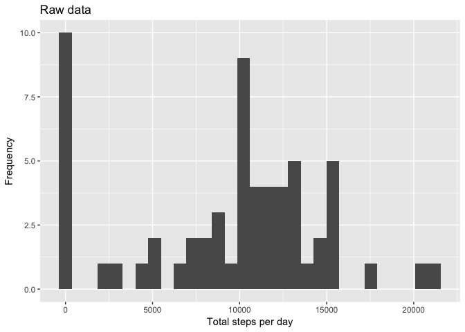
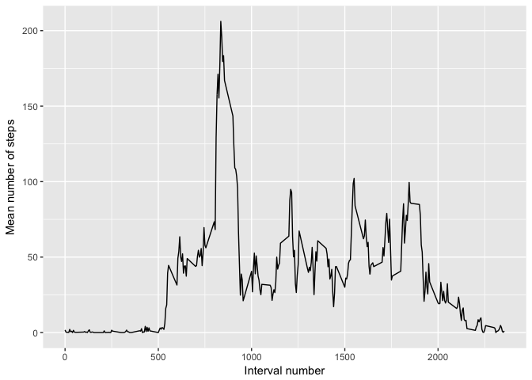
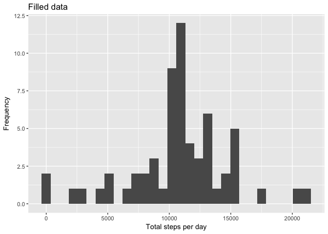
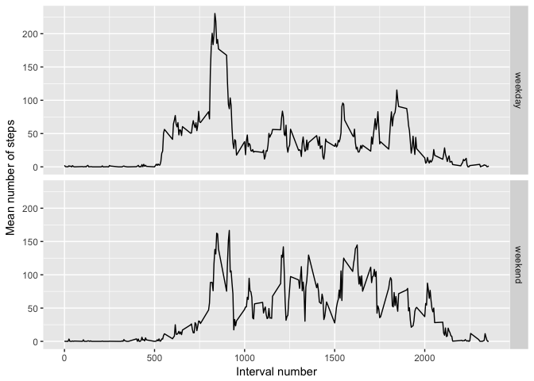

```r
## Load required libraries
library(dplyr)
```

```
## 
## Attaching package: 'dplyr'
```

```
## The following objects are masked from 'package:stats':
## 
##     filter, lag
```

```
## The following objects are masked from 'package:base':
## 
##     intersect, setdiff, setequal, union
```

```r
library(ggplot2)
```

## Loading and preprocessing the data


```r
## Load the data with properly identified column types
data <- read.csv("data/activity.csv", header = TRUE,
                 colClasses = c("numeric", "Date", "integer"))
```

## What is mean total number of steps taken per day?


```r
## Calculate total number of steps per day
total_steps_daily <- data %>%
  group_by(date) %>%
  summarise(total = sum(steps, na.rm = TRUE))

## Histogram of total number of steps per day
qplot(total, data = total_steps_daily,
      xlab = "Total steps per day",
      ylab = "Frequency",
      main = "Raw data")
```

```
## `stat_bin()` using `bins = 30`. Pick better value with `binwidth`.
```

<!-- -->

```r
## Calculate and report mean & median total number of steps per day
mean_steps_daily <- mean(total_steps_daily$total, na.rm = TRUE)
print(paste0("MEAN total number of steps per day (rounded): ",
             round(mean_steps_daily,0)))
```

```
## [1] "MEAN total number of steps per day (rounded): 9354"
```

```r
median_steps_daily <- median(total_steps_daily$total, na.rm = TRUE)
print(paste0("MEDIAN total number of steps per day (rounded): ",
             round(median_steps_daily,0)))
```

```
## [1] "MEDIAN total number of steps per day (rounded): 10395"
```

## What is the average daily activity pattern?


```r
## Calculate average activity in each interval over all days
mean_activity_daily <- data %>%
  group_by(interval) %>%
  summarise(mean = mean(steps, na.rm = TRUE))

## Plot timeseries of average daily activity per interval
p <- ggplot(mean_activity_daily) +
  geom_line(aes(x = interval, y = mean)) +
  labs(x = "Interval number",
       y = "Mean number of steps")

print(p)
```

<!-- -->

```r
## Find and report most active interval on average
max_steps_interval <- with(mean_activity_daily,
                           interval[which(mean == max(mean))])

print(paste0("Most active interval on average: ", max_steps_interval))
```

```
## [1] "Most active interval on average: 835"
```

## Imputing missing values


```r
## Calculate and report number of missing values in the data set
missing_rows <- !complete.cases(data)
num_missing_rows <- sum(missing_rows)
print(paste0("Number of rows with missing values: ",
             num_missing_rows))
```

```
## [1] "Number of rows with missing values: 2304"
```

```r
## Copy data to fill in missing values
filled_data <- data

## Fill missing values with mean for the interval
for (i in seq_along(missing_rows)){
  if (missing_rows[i]){
    the_interval <- data$interval[i]
    filled_data$steps[i] <- with(mean_activity_daily,
                              mean[which(interval==the_interval)])
  }
}

## Calculate total number of steps per day
## (with missing data filled in)
total_steps_daily_filled <- filled_data %>%
  group_by(date) %>%
  summarise(total = sum(steps, na.rm = TRUE))

## Histogram of total number of steps per day
## (with missing data filled in)
qplot(total, data = total_steps_daily_filled,
      xlab = "Total steps per day",
      ylab = "Frequency",
      main = "Filled data")
```

```
## `stat_bin()` using `bins = 30`. Pick better value with `binwidth`.
```

<!-- -->

```r
## Calculate and report mean & median total number of steps per day
mean_steps_daily_filled <- mean(total_steps_daily_filled$total, na.rm = TRUE)
print(paste0("MEAN total number of steps per day (rounded, filled data): ",
             round(mean_steps_daily_filled,0)))
```

```
## [1] "MEAN total number of steps per day (rounded, filled data): 10766"
```

```r
median_steps_daily_filled <- median(total_steps_daily_filled$total, na.rm = TRUE)
print(paste0("MEDIAN total number of steps per day (rounded, filled data): ",
             round(median_steps_daily_filled,0)))
```

```
## [1] "MEDIAN total number of steps per day (rounded, filled data): 10766"
```

Replacing missing values with the mean for the given 5-minute intervals over all days decreases the number of days with zero steps and increases the number of days around the center of the distribution. This replacement scheme also increases the mean significantly (~15\%) and the median slightly (~4\%). 

## Are there differences in activity patterns between weekdays and weekends?


```r
## Add new column to filled data indicating weekday or weekend
## (assume weekday by default)
filled_data$weektime <- rep("weekday", nrow(filled_data))
levels(filled_data$weektime) <- c("weekday", "weekend")

## Loop through rows in filled data and change weektime value to 
## weekend if the weekday of the date corresponds to Saturday
## or Sunday
for (i in 1:nrow(filled_data)){
  weektime <- weekdays(filled_data$date[i])
  if (weektime %in% c("Saturday", "Sunday")){
    filled_data$weektime[i] <- "weekend"
  }
}

## Calculate daily average for each interval
## split by weektime
mean_steps_daily_weektime <- filled_data %>%
  group_by(interval, weektime) %>%
  summarise(mean = mean(steps))

## Make panel plot of timeseries for daily average
## split by weektime
p <- ggplot(mean_steps_daily_weektime) +
  geom_line(aes(x = interval, y = mean)) + 
  facet_grid(weektime ~.) +
  labs(x = "Interval number",
       y = "Mean number of steps")

print(p)
```

<!-- -->
