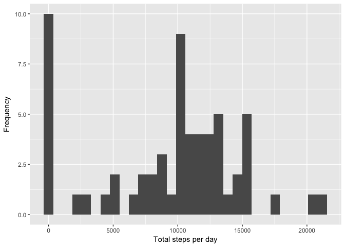
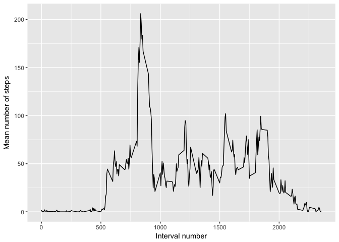

```r
## Load required libraries
library(dplyr)
```

```
## 
## Attaching package: 'dplyr'
```

```
## The following objects are masked from 'package:stats':
## 
##     filter, lag
```

```
## The following objects are masked from 'package:base':
## 
##     intersect, setdiff, setequal, union
```

```r
library(ggplot2)
```

## Loading and preprocessing the data


```r
## Load the data with properly identified column types
data <- read.csv("data/activity.csv", header = TRUE,
                 colClasses = c("numeric", "Date", "integer"))
```

## What is mean total number of steps taken per day?


```r
## Calculate total number of steps per day
total_steps_daily <- data %>%
  group_by(date) %>%
  summarise(total = sum(steps, na.rm = TRUE))

## Histogram of total number of steps per day
qplot(total, data = total_steps_daily,
      xlab = "Total steps per day",
      ylab = "Frequency")
```

```
## `stat_bin()` using `bins = 30`. Pick better value with `binwidth`.
```

<!-- -->

```r
## Calculate and report mean & median total number of steps per day
mean_steps_daily <- mean(total_steps_daily$total, na.rm = TRUE)
print(paste0("MEAN total number of steps per day (rounded): ",
             round(mean_steps_daily,0)))
```

```
## [1] "MEAN total number of steps per day (rounded): 9354"
```

```r
median_steps_daily <- median(total_steps_daily$total, na.rm = TRUE)
print(paste0("MEDIAN total number of steps per day (rounded): ",
             round(median_steps_daily,0)))
```

```
## [1] "MEDIAN total number of steps per day (rounded): 10395"
```

## What is the average daily activity pattern?


```r
## Calculate average activity in each interval over all days
mean_activity_daily <- data %>%
  group_by(interval) %>%
  summarise(mean = mean(steps, na.rm = TRUE))

## Plot timeseries of average daily activity per interval
p <- ggplot(mean_activity_daily) +
  geom_line(aes(x = interval, y = mean)) +
  labs(x = "Interval number",
       y = "Mean number of steps")

print(p)
```

<!-- -->

```r
## Find most active interval on average
max_steps_interval <- with(mean_activity_daily,
                           interval[which(mean == max(mean))])

print(paste0("Most active interval on average: ", max_steps_interval))
```

```
## [1] "Most active interval on average: 835"
```

## Imputing missing values


## Are there differences in activity patterns between weekdays and weekends?
